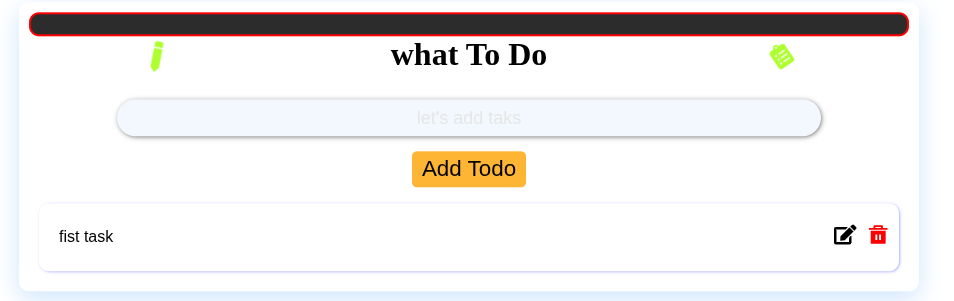
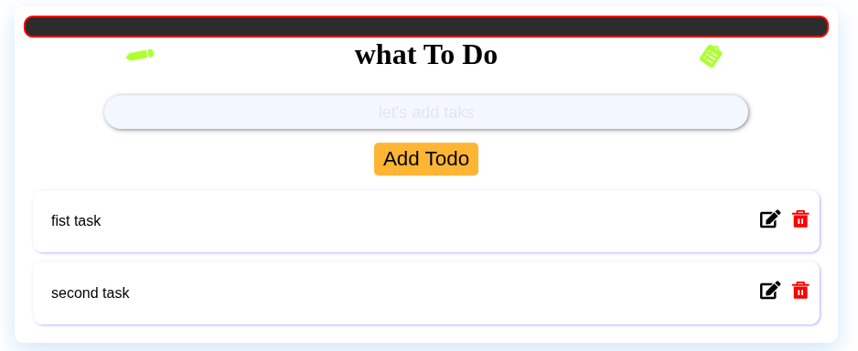

# Todo List App

A simple Todo List web application built using **React**, **TypeScript**, **HTML**, and **CSS**.

## 🚀 Features

- ✅ Add tasks
- ✏️ Edit tasks
- 🗑️ Delete tasks

## 📸 Demo Screenshots

### ➕ Adding a Task




### 📝 Editing a Task


### ❌ Deleting a Task




## 🛠️ How to Run Locally

> Make sure you have **Node.js** and **npm** installed.

1. Clone the repository:
   ```bash
   git clone https://github.com/danipy2/a2svtask4.git
   cd task4
   npm install
   npm run dev
   ```
